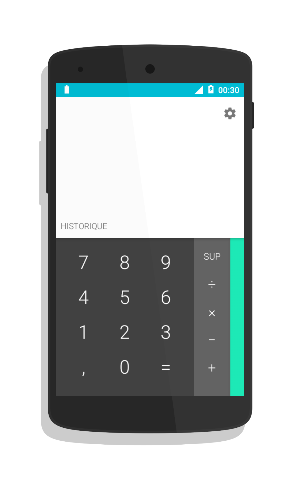
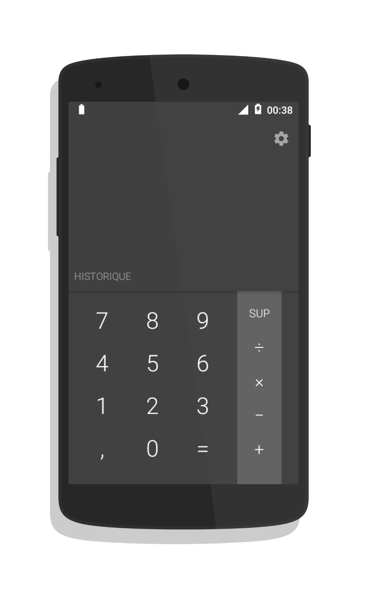
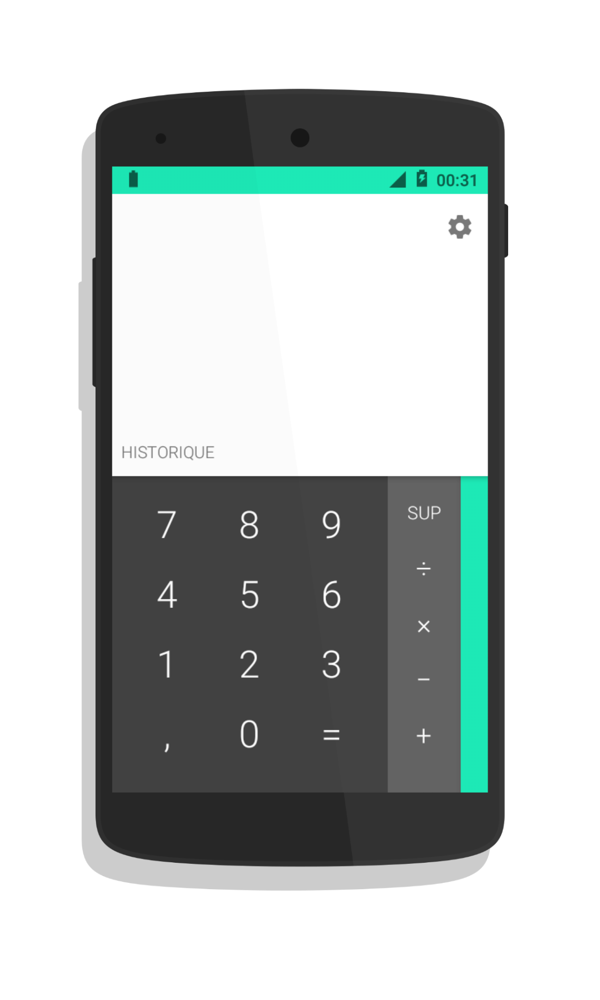
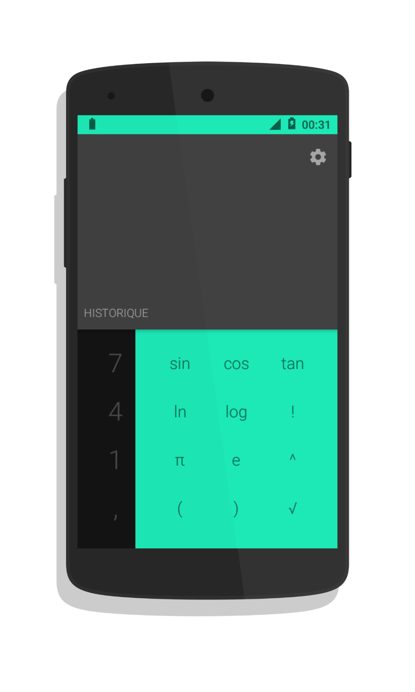
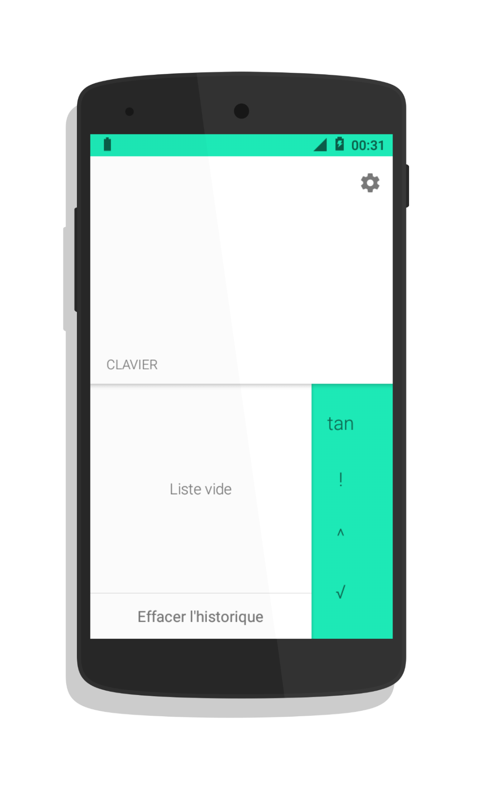
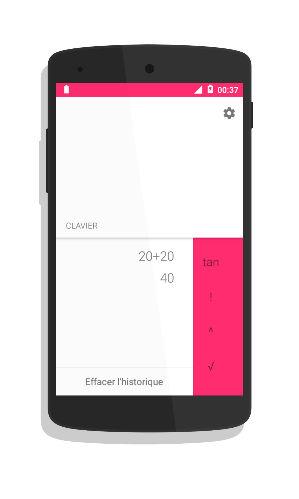
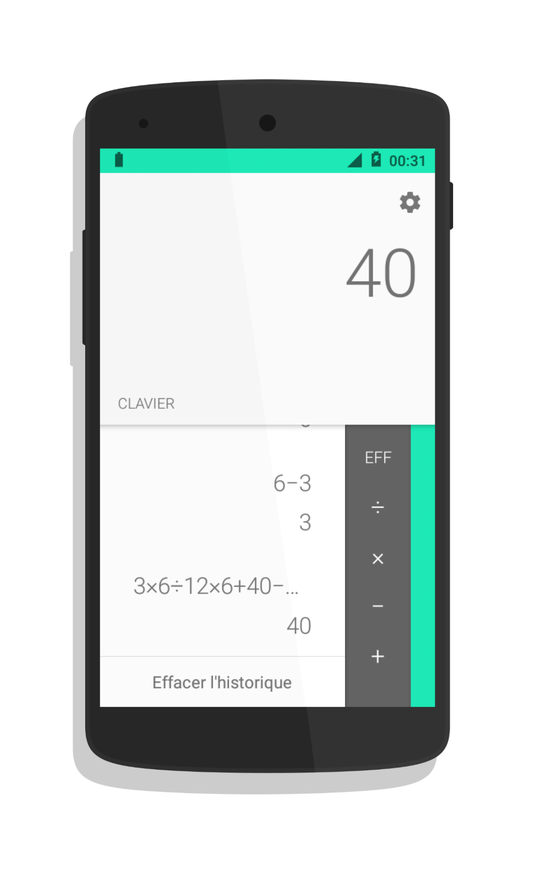
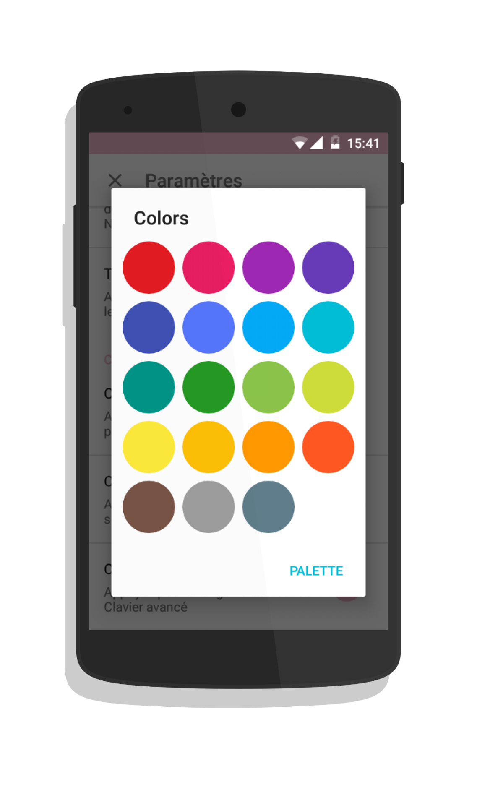
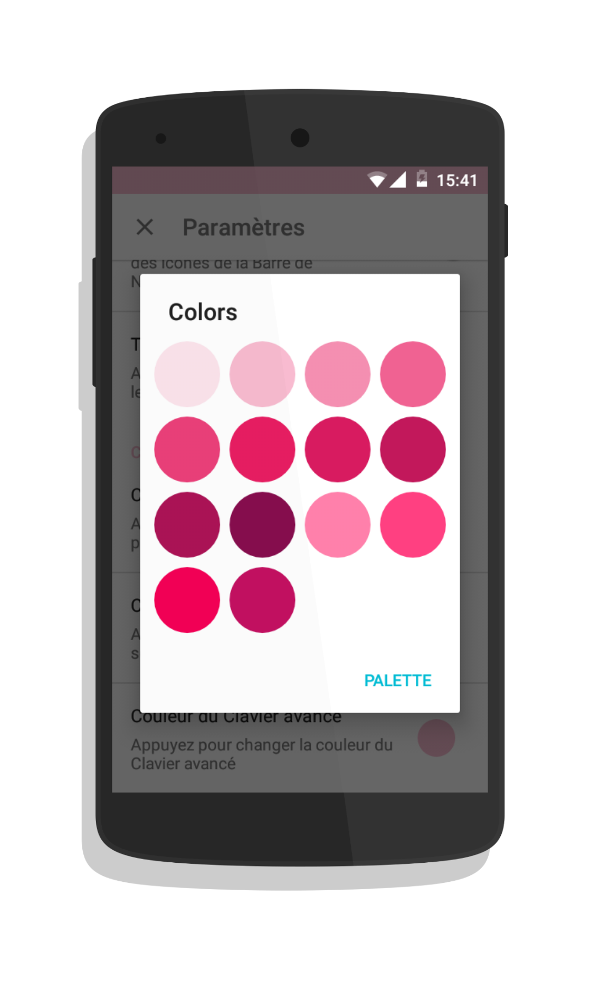
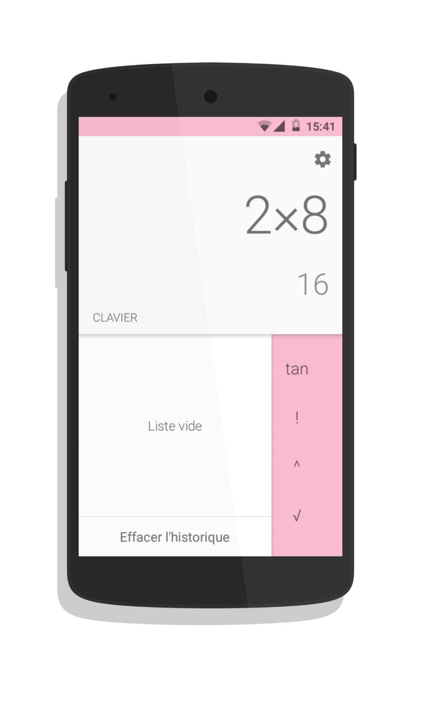

# MSay2-Calculator


> MSay2-Calculator resumes the same design as the Calculator application under Android Marshmallow

# Screenshots












# Information

Min API: Android Lollipop

# Calculator

<a href="https://raw.githubusercontent.com/MSay2/MSay2-Calculator/master/application/Calculator.apk" > </a>

##### Version

###### 2.0
* Bug fixes
* Improvements made
* Reduced of the application size

###### 1.0
* Initialization

# License

```
Copyright 2017 MSay2

Licensed to the Apache Software Foundation (ASF) under one or more contributor
license agreements. See the NOTICE file distributed with this work for
additional information regarding copyright ownership. The ASF licenses this
file to you under the Apache License, Version 2.0 (the "License"); you may not
use this file except in compliance with the License. You may obtain a copy of
the License at

   http://www.apache.org/licenses/LICENSE-2.0

Unless required by applicable law or agreed to in writing, software
distributed under the License is distributed on an "AS IS" BASIS, WITHOUT
WARRANTIES OR CONDITIONS OF ANY KIND, either express or implied. See the
License for the specific language governing permissions and limitations under
the License.
```
